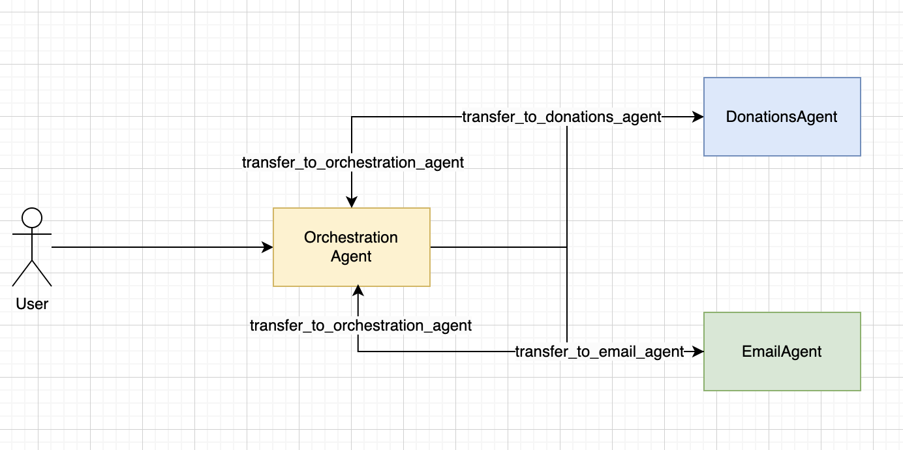
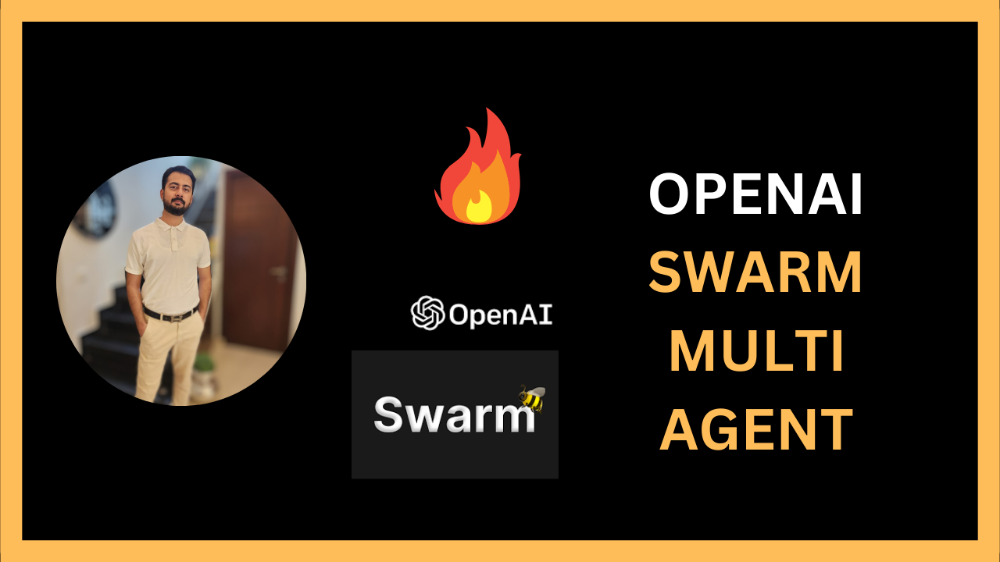

## Architecture

# OpenAI Swarm 🐝 - Multi-Agent Orchestration Framework

**Orchestrate and collaborate AI agents in one seamless framework!**  
**Demo Setup**: 1 Orchestrator Agent + 2 Worker Agents (Natural Language to SQL Agent, Email Agent)

---

### About This Repository
OpenAI Swarm is a practical multi-agent orchestration framework that lets you deploy, manage, and scale specialized AI agents working together to handle complex workflows. In this demo, a central **Orchestrator Agent** intelligently assigns tasks to two **Worker Agents**:
  
- **Natural Language to SQL Agent**: Translates plain language commands into SQL queries.
- **Email Agent**: Composes and sends emails based on custom user inputs.

---

### 🌟 Key Features
- **Dynamic Multi-Agent Orchestration**: Coordinate specialized AI tasks with ease.
- **Real-World Application**: Ideal for automating workflows in customer service, database management, email automation, and more.
- **Modular & Extensible**: Built to add more agents as your project grows!

---

### 🚀 Get Started
Clone the repo, follow the setup instructions, and run the demo to see how easy it is to orchestrate specialized AI agents in a single framework. Perfect for AI enthusiasts, developers, and anyone building advanced, task-driven AI applications!

---

## Youtube

## Blog

[OpenAI Swarm – Multi AI Agent Orchestration](https://talhagillani.com/openai-swarm-multi-ai-agent-orchestration/)

---

### 📲 Explore More Here

